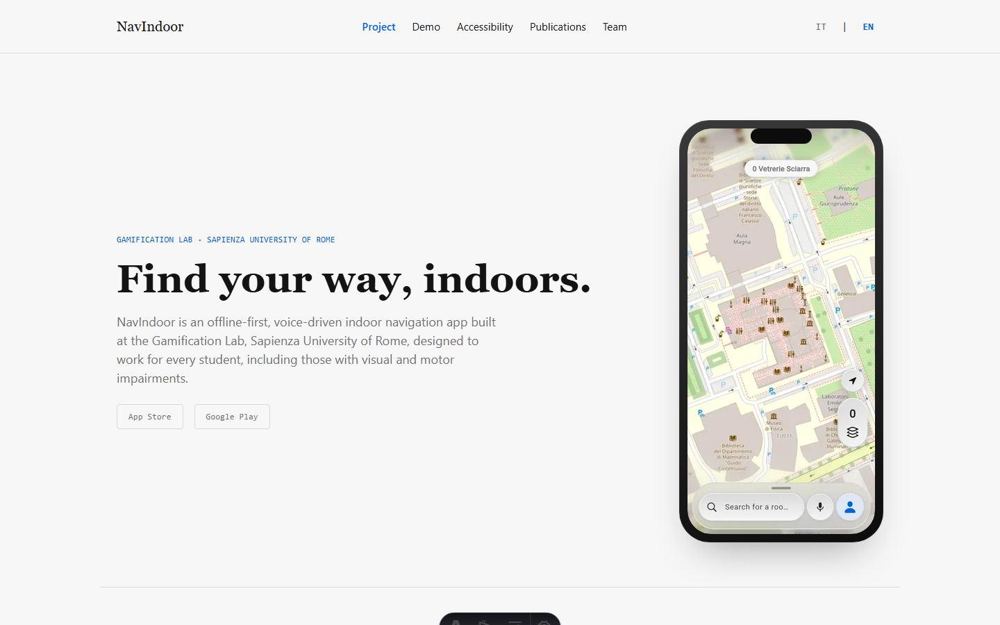

# NavIndoor Website

Bilingual (EN/IT) marketing site for NavIndoor, an offline-first,
voice-driven indoor navigation app built at the Gamification Lab,
Sapienza University of Rome.

Built with [Astro](https://astro.build).



## Development

```sh
npm install
npm run dev